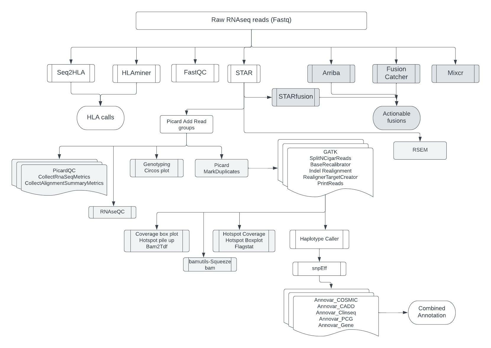

## 1. Overview
RNA-sequencing has wide variety of applications. The power of sequencing RNA lies in the fact that the twin aspects of discovery and quantification can be combined in a single high-throughput sequencing assay called RNA-sequencing. RNA-seq can be coupled with different types of biochemical assay to analyze many other aspects of RNA biology, such as RNA–protein binding, RNA structure, or RNA–RNA interactions. This pipeline presents optimal methods for transcript quantification, fusion detection, variant analysis and QC.

## 2. Mapping
**STAR** aligner is designed to specifically address many of the challenges of RNA-seq data mapping using a strategy to account for spliced alignments. STAR aligns the non-contiguous sequences directly to the reference genome. We use STAR "TwopassMode"; in the first pass, the novel junctions are detected and inserted into the genome indices. In the second pass, all reads will be re-mapped using annotated (from the GTF file) and novel (detected in the first pass) junctions. While this doubles the run time, it significantly increases sensitivity to novel splice junctions. The genome versions and the tool versions are listed [here](../resources.md). We generate two bam files from the STAR alignment.

| **Bam**                | **Purpose**                    |
|----------------------- |:------------------------------:|
|Transcriptome bam       |       For gene Quantification  |
| Genome bam             |       For variant analysis     |

## 3. Quantification
**RSEM** is an accurate and user-friendly software tool for estimating gene and isoform expression levels from RNA-Seq data. The RSEM package supports threads for parallel computation of the EM algorithm, single-end and paired-end read data, quality scores, variable-length reads and RSPD estimation. In addition, it provides posterior mean and 95% credibility interval estimates for expression levels. 

## 4. Fusion Detection
**Arriba** is a command-line tool for the detection of gene fusions from RNA-Seq data. It is based on the ultrafast STAR aligner, and renders detailed quality visualizations of the transcripts involved in predicted fusions. It generates a PDF file with one page for each predicted fusion. Each page depicts the fusion partners, their orientation, the retained exons in the fusion transcript and statistics about the number of supporting reads.

**STAR-Fusion** is a component of the Trinity Cancer Transcriptome Analysis Toolkit (CTAT). STAR-Fusion uses the STAR aligner to identify candidate fusion transcripts supported by Illumina reads. STAR-Fusion further processes the output generated by the STAR aligner to map junction reads and spanning reads to a reference annotation set. STAR-Fusion can be run using fastq files as input or using the 'Chimeric.junction.out' file from STAR mapping. This pipeline uses the later technique.

**FusionCatcher** searches for somatic novel/known fusion genes, translocations and/or chimeras in RNA-seq data. FusionCatcher achieves competitive detection rates and real-time PCR validation rates in RNA-sequencing data from tumor cells.

## 4. Variant Analysis

## 5. Annovar - Annotation

