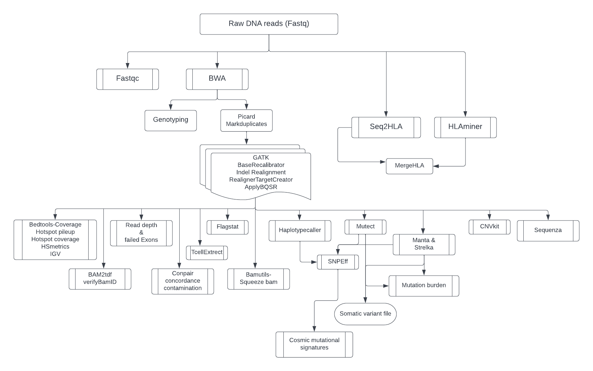

## 1.Overview
Exome sequencing allows cancer researchers to assess only coding regions, which frequently contain mutations that affect tumor progression. Depending on experimental needs, the content for cancer exome sequencing can also be expanded to untranslated regions and microRNA (miRNA) binding sites. Because it offers an accessible combination of turnaround time and price, exome sequencing is the method of choice for many tumor-normal comparisons. Tumor-normal comparisons are crucial for identifying the somatic variants that act as driver mutations in cancer progression. 

## 2. Mapping
BWA is a software package for mapping low-divergent sequences against a large reference genome, such as the human genome. We use BWA-mem which is generally recommended for high-quality queries as it is faster and more accurate. BWA-MEM also has better performance than BWA-backtrack for 70-100bp Illumina reads.

## 3. Picard

## 4. Variant Analysis

### a. Somatic Variant Calling

**Strelka** calls somatic small variants from mapped sequencing reads in tumor/normal sample pairs. Strelka accepts input read mappings from BAM or CRAM files, and optionally candidate and/or forced-call alleles from VCF. For best somatic indel performance, Strelka is designed to be run with the Manta structural variant and indel caller, which provides additional indel candidates up to a given maxiumum indel size (by default this is 49). By design, Manta and Strelka run together with default settings provide complete coverage over all indel sizes (in additional to all SVs and SNVs) for clinical somatic analysis. 

**MuTect**

### b. Germline Variant Calling

**Seq2HLA**

**HLAminer**  HLA prediction by targeted assembly of short sequence reads (HPTASR), performs targeted de novo assembly of HLA NGS reads and align the resulting contigs to reference HLA alleles from the IMGT/HLA sequence repository using commodity hardware with standard specifications (<2GB RAM, 2GHz). Putative HLA types are inferred by mining and scoring the contig alignments and an expect value is determined for each. The method is accurate, simple and fast to execute and, for transcriptome data, requires low depth of coverage.

**HaplotypeCaller** is capable of calling SNPs and indels simultaneously via local de-novo assembly of haplotypes in an active region

## 5. Variant Annotation

## 6. Copy number Analysis

**CNVkit** is a Python library and command-line software toolkit to infer and visualize copy number from high-throughput DNA sequencing data. 

## 7. Mutation Burden & Mutational Signatures
